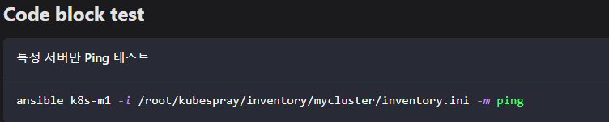

# Docusaurus 설정 사항들

### Codeblock 설정

[dosusaurus.config.js](../../docusaurus.config.js) 테마 설정 부분에 사용할  Language 추가

```js title="Add Highlight Language"
prism: {
    theme: prismThemes.github,
    darkTheme: prismThemes.dracula,
    additionalLanguages: ['java', 'bash'],  /* 이 부분 추가 */
},
```

- Codeblock **title** 설정

Codeblock `js title="Add Highlight Language"` 언어 다음 title을 사용해 title을 설정할 수 있다.




### 테마설정


### Footer 설정


### Nav 설정


### Header 색상 & 폰트 설정 
- H1, H2, H3, H4, H5 색상 설정

### Git 연결 설정

### Sidebar 설정

### Site title 설정
